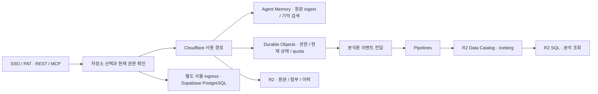

# Cloudflare 중심 Memory 저장 구조와 R2 SQL 검토

확인일: 2026-09-11. 공개 공식 문서에 근거한 기술 검토이며, 계정별 계약·비공개 제공 기능을 확인한 결과는 아니다.

후속 결정인 의료정보 동의 플래그, 고객사 공통 동의의 자동 적용, 혼합 메모리 분리 질의와 임베딩 모델 교체는 [에이전트 라우팅 계약](agent-routing.ko.md)에 정리했다.

## 최신 제품 결정

사용자는 원문 대화 전체를 Cloudflare Agent Memory `ingest`에 전달하는 것을 핵심 기능으로 승인했다. 법률 리서치와 Cloudflare 협의는 사용자가 진행한다. 계약 완료, BAA 확인 또는 필터링만 허용하는 기능 제한을 현재 구현의 선행 조건으로 추가하지 않는다.

사용자의 후속 방향은 **Cloudflare에서 가능한 저장·처리를 Cloudflare에 모으고, Cloudflare 밖에 따로 두어야 한다고 지정한 데이터만 서울 PostgreSQL에 둔다**는 것이다. 따라서 앞서 시작한 일반 메모리→Neon Singapore, 의료 프로필→Supabase Seoul의 전면 PostgreSQL 이식 계획은 기본 아키텍처에서 제외한다. 작성한 PostgreSQL 기반 코드와 D1 기존 코드는 보존한다. Neon 리소스를 삭제하거나 기존 운영 저장소를 이미 전환했다는 의미는 아니다.

의료라는 분류만으로 Cloudflare ingest를 일괄 금지하지 않는다. 실제로 Cloudflare와 분리하기로 지정한 데이터는 별도 서울 경로로 다룬다. 이 경로는 Cloudflare 사본을 갖는 일반 경로와 구별해 표시해야 한다. 특정 데이터에 대해 서울 주 저장과 Cloudflare 처리 사본을 함께 쓰기로 정한다면, 이를 모든 사본이 서울에만 있다는 보장으로 표현하지 않는다.

## 결론

**R2 SQL은 PostgreSQL의 분석 업무 상당 부분을 맡을 수 있지만, 현재 온라인 트랜잭션 DB 전체를 대체할 수 없다. 서울 강제 저장·실행을 제공하는 공개 R2 SQL 옵션도 확인되지 않는다.**

R2 SQL은 R2 Data Catalog의 Apache Iceberg 테이블을 읽는 분산 분석 엔진이다. `SELECT`, JOIN, 집계, window function을 지원하지만 `INSERT`, `UPDATE`, `DELETE`와 DDL은 지원하지 않는다. 따라서 외부 PostgreSQL을 줄이는 목표와 R2 SQL 하나로 모든 상태를 관리하는 것은 구분해야 한다. [제품 개요](https://developers.cloudflare.com/r2-sql/), [지원 범위](https://developers.cloudflare.com/r2-sql/reference/limitations-best-practices/).

## 권장 데이터 배치

아래는 확인된 제품 기능을 Memory 서비스 요구사항에 적용한 **설계 판단**이다. 아직 운영 전환을 완료한 구성이 아니다.

| 데이터 / 동작 | 배치 | 역할 |
|---|---|---|
| 원문 대화 ingest, 자동 추출, 의미 검색·기억 요약 | Cloudflare Agent Memory | 원문 저장을 포함한 핵심 메모리 처리. 별도 pgvector를 필수로 두지 않음 |
| 파일·첨부·서비스가 관리하는 원문 사본·변경 이력·내보내기 | R2 | 객체 ID와 버전으로 직접 읽고 쓰는 저장소. 모든 요청에서 R2 SQL 분석을 거치지 않음 |
| 대화/변경 이벤트 분석, 감사 이력 조회, 사용량 통계 | R2 Data Catalog + Pipelines + R2 SQL | Iceberg/Parquet 누적 데이터의 배치 분석. 로그인·권한 판단의 기준으로 사용하지 않음 |
| 조직·Space 권한, PAT 회수, 현재 revision, 삭제 상태, 중복 요청, quota 예약 | SQLite 기반 Durable Objects | 실시간 트랜잭션과 서비스 자체 권한 판단. 기존 D1 미사용 요구를 유지하는 Cloudflare 내 대안 |
| 사용자 지정 Cloudflare 외부 격리 데이터 | Supabase Seoul PostgreSQL | 서울 예외 저장소. 해당 데이터에 Cloudflare의 자동 사본·검색·백업 경로를 붙이지 않음 |

Agent Memory는 내부에 원문과 추출 기억을 저장하고 벡터 검색을 제공한다. 서비스가 같은 벡터를 pgvector와 별도 Vectorize에 다시 이중 기록할 필요는 없다. 직접 Vectorize는 관리형 Agent Memory를 사용하지 않는 검색 구현을 택할 때의 별도 선택지다. [내부 구조](https://blog.cloudflare.com/introducing-agent-memory/), [처리 방식](https://developers.cloudflare.com/agent-memory/concepts/how-agent-memory-works/).

도식의 Route는 논리적인 선택이다. Cloudflare에 들어오면 안 되는 원문까지 전역 Worker에서 먼저 읽은 뒤 서울로 전달한다는 뜻이 아니다. 별도 서울 ingress/로그/백업 범위는 해당 예외 프로필을 실제 배포할 때 검증한다.

## R2 SQL로 가능한 범위와 남는 상태 저장소

R2 객체 업로드와 Iceberg 테이블 갱신은 R2 SQL의 쓰기 기능이 아니다. Cloudflare 안에서 이벤트를 적재하려면 Pipelines가 Iceberg/Parquet를 생성하도록 연결할 수 있다. Data Catalog sink reference는 파일 기록 간격을 최소 60초, 기본 300초로 설명하지만 일부 tutorial의 30초 예시와 차이가 있다. 이를 실제 데이터의 조회 가능 시간 보장으로 취급하지 않는다. 요청이 승인되는 순간의 잔여 한도나 회수된 PAT를 이 경로에서 판정하면 안 된다. Iceberg의 분석용 ACID snapshot도 서비스의 여러 상태를 한 번에 변경하는 PostgreSQL 트랜잭션 API를 제공한다는 뜻은 아니다. [Pipelines](https://developers.cloudflare.com/pipelines/), [Data Catalog sink](https://developers.cloudflare.com/pipelines/sinks/available-sinks/r2-data-catalog/).

Durable Objects는 로컬 SQLite 트랜잭션을 제공한다. 조직/Space별로 큰 payload는 R2에 두고 권한·포인터·현재 상태를 작게 유지하는 구성이 가능하다. Paid의 **객체 하나당 10GB** 제한은 남아 있으므로 하나의 객체에 전체 서비스 데이터를 쌓지 않는다. 객체 수를 늘리는 것이 여러 객체 사이의 원자적 트랜잭션을 자동으로 제공하지는 않는다. 계정 공통 quota와 Space 변경은 명시적인 예약·만료·fencing·재조정 규약으로 연결하고, 동시 요청 테스트가 필요하다. [SQLite transaction API](https://developers.cloudflare.com/durable-objects/api/sqlite-storage-api/), [용량 제한](https://developers.cloudflare.com/durable-objects/platform/limits/).

R2 SQL에 개인별 mutable 원문을 모두 넣는 것은 삭제 구현까지 포함해 판단해야 한다. Data Catalog의 조건부 행 삭제는 현재 Iceberg 호환 엔진과 catalog transaction을 통해 수행하는 별도 작업이다. 과거 snapshot과 참조 파일도 정리해야 하며, R2 파일을 직접 지워 catalog를 깨뜨려서는 안 된다. 먼저 R2 SQL을 이벤트·통계·이력 분석에 적용하고, 원문은 개별 R2 객체와 Agent Memory 삭제 흐름으로 관리한다. [Data Catalog 삭제](https://developers.cloudflare.com/r2-data-catalog/deleting-data/).

## 서울 강제 옵션 확인

| 확인 대상 | 공개 지원 상태 | 서울 격리 판단 |
|---|---|---|
| R2 `apac` location hint | 최선 노력 방식의 아시아·태평양 위치 힌트 | 한국 또는 서울 보장이 아님 |
| R2 jurisdiction | 문서상 `eu`, `fedramp`, `us` | `kr`, `seoul`, `ap-northeast-2` 강제 옵션 없음 |
| R2 Data Catalog | non-default jurisdiction 버킷을 현재 지원하지 않음 | jurisdiction 버킷으로 SQL 저장 위치를 강제하는 구성도 현재 적용 불가 |
| R2 SQL query 실행 | Cloudflare 분산 query engine | 서울 실행·임시파일·결과·로그만을 강제하는 공개 설정을 확인하지 못함 |

[R2 data location, 2026-08-19 갱신](https://developers.cloudflare.com/r2/reference/data-location/), [Data Catalog 제한](https://developers.cloudflare.com/r2-data-catalog/manage-catalogs/), [R2 SQL 구조](https://developers.cloudflare.com/r2-sql/).

한국에서 버킷을 생성하거나 SDK의 AWS 리전 문자열을 서울로 적는 방식은 강제 보장이 아니다. Workers/HTTPS의 Regional Services 설정이 R2 Data Catalog나 Agent Memory의 내부 DB·Vectorize·AI·백업에 그대로 적용된다고 가정하지 않는다. 공식 문서에 없는 Enterprise 또는 비공개 지원 가능성은 Cloudflare와 별도 확인할 항목이다. [Workers 지역 제한의 적용 범위](https://developers.cloudflare.com/data-localization/how-to/workers/).

## 비용과 운영 조건

공개 R2 SQL 단가는 compressed scan 기준 **$0.0025/GB, 즉 $2.50/TB**, 월 10GB 포함, query당 최소 10MB다. R2 저장/요청, Catalog 작업/compaction은 별도다. 예를 들어 표준 R2에 100GB를 한 달 보관하고 월 1,000GB를 scan하면, 해당 무료 구간을 전부 사용할 수 있다는 가정에서 저장 $1.35 + SQL $2.475 = 약 $3.83이다. 이는 다른 서비스와 작업 비용을 제외한 예시이며 계정의 실제 청구액이 아니다. [R2 SQL 가격](https://developers.cloudflare.com/r2-sql/platform/pricing/), [R2 가격](https://developers.cloudflare.com/r2/pricing/).

Pipelines는 SQL 변환과 sink 전달량을 별도 계산하고, Data Catalog는 catalog 요청과 compaction 비용이 추가될 수 있다. 따라서 Memory의 Cloudflare 월 $50 목표는 Workers/DO/AI/Agent Memory와 합산해 확인한다. query마다 기간·Space를 제한하고, 정기 분석은 증분 집계와 partition pruning을 적용한다. [Pipelines 가격](https://developers.cloudflare.com/pipelines/platform/pricing/), [Data Catalog 가격](https://developers.cloudflare.com/r2-data-catalog/platform/pricing/).

Agent Memory는 문서상 private beta이고 현재 과금하지 않는다고 안내한다. 이를 영구 무료나 공개 GA 계약 보장으로 계산하지 않는다. R2 SQL도 open beta이므로 핵심 로그인·권한·쓰기의 필수 의존성으로 만들지 않는다. [Agent Memory 가격](https://developers.cloudflare.com/agent-memory/platform/pricing/), [R2 SQL 상태](https://developers.cloudflare.com/r2-sql/).

## Cloudflare에 확인할 기술 질문

사용자의 법률 리서치와 별도로 공급자에게 전달할 수 있는 기술 질문이다. 이 문서를 작성하면서 실제 문의를 보내지는 않았다.

1. R2에 한국/서울을 강제하는 비공개 jurisdiction 또는 계약 옵션이 있는가? 원본·복제본·복구본·키와 운영자 접근의 범위는 무엇인가?
2. 그 옵션을 R2 Data Catalog, R2 SQL의 query 실행·임시 spill·결과·metadata·로그·compaction에도 사용할 수 있는가? 현재 문서의 non-default jurisdiction 제한에 예외가 있는가?
3. Agent Memory의 원문, 추출 결과, 내부 Vectorize, Workers AI, 로그와 백업은 각각 어느 위치에서 처리되는가? 서비스 범위와 BAA 적용 범위를 제품명별로 확인할 수 있는가?
4. `ingest` 완료/실패의 최종 상태, 중복 판단, session 삭제 후 검색·원문·백업 정리의 완료 증거 또는 보장 시간은 무엇인가?
5. Agent Memory 운영 가입 가능 여부, 정식 제공 일정·지원 조건과 예상 가격, R2 SQL의 실제 과금 개시 상태를 확인할 수 있는가?

## 현재 코드와 다음 실행 범위

- 기존 D1 운영은 이 리서치로 바뀌지 않았다. 기존 코드 보존과 향후 활성 D1 제거 요구는 유지한다.
- PostgreSQL 연결/트랜잭션·격리 schema·지역 배치 기반의 68개 신규 테스트와 기존 1,882개 테스트는 2026-09-11 로컬 전체 검사에서 통과했다. 이 코드는 선택 가능한 기반이며 Cloudflare 중심 운영 구현이나 전환 증거가 아니다.
- 일반 메모리→Singapore PostgreSQL 전면 이식 확장은 중단했다. SQL 0004 이후의 추가 이식은 착수하지 않았다.
- Agent Memory 원문 ingest HTTP 연동은 별도 코드 작업으로 진행한다. HTTP 호출 성공은 앱의 PAT/SSO 권한·삭제·quota 흐름 연결 완료를 의미하지 않는다.
- 다음 구현 순서는 Agent Memory 원문 ingest/조회/삭제의 실제 계약 확인, Cloudflare 내 권한·작업 상태의 Durable Objects 포트, R2 복구·삭제 연결, 분석 이벤트의 Catalog/SQL 연결, 서울 예외 경로 검증이다. 사용자 지정 배치와 namespace/profile 경계, 늦게 완료된 ingest의 삭제 재조정은 모든 단계에서 유지한다.
